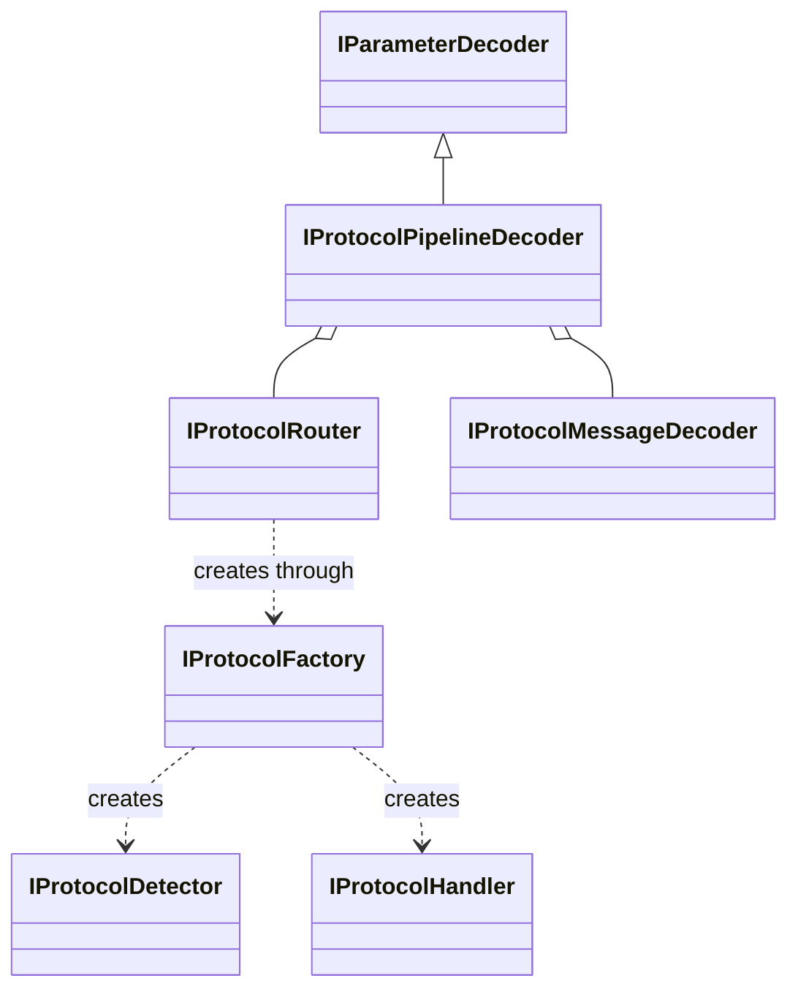

# 多协议扩展抽象接口

本轮交付 C++20 抽象类、配套数据类型及编译/契约测试。默认采用自动识别策略，允许按输入来源和通道手动指定协议。具体协议、识别算法、运行时路由实现及命令行配置入口均留待后续开发。

## 类的职责

声明位于 [`protocol_interfaces.hpp`](../include/core/protocol_interfaces.hpp)，配套类型位于 [`protocol_types.hpp`](../include/core/protocol_types.hpp)。六个接口都是带虚析构函数的纯抽象类。

| 抽象类 | 后续派生类承担的责任 |
|---|---|
| `IProtocolDetector` | 检查同一数据流的有限观察窗口，返回候选协议、证据和识别状态 |
| `IProtocolHandler` | 解析一个数据流、一个代次的协议报文，维护组帧状态并检查格式 |
| `IProtocolFactory` | 描述已支持的协议，为指定协议创建识别器或解析器 |
| `IProtocolRouter` | 保存每个来源/通道的选择策略、输入描述、识别和解析状态，执行分派 |
| `IProtocolMessageDecoder` | 将协议消息按设备参数字典转换为统一工程参数 |
| `IProtocolPipelineDecoder` | 继承现有 `IParameterDecoder`，组合路由器和消息解码器，接入原有处理管线 |

后续派生关系与组合关系如下；图中的具体实现本次不提供。



后续加入某种协议时，实现相应的 `IProtocolDetector`、`IProtocolHandler` 并由工厂创建；设备工程量映射由 `IProtocolMessageDecoder` 的派生类处理。识别出的协议类型本身不能确定某个字段对应的物理量、比例或单位。

## 自动与手动策略

`ProtocolSelection{}` 和 `ProtocolSelection::automatic()` 都表示自动模式。`ProtocolSelection::manual(id)` 表示手动模式，编号 `0` 保留为未知，不能用于手动指定。协议编号是本程序内部标识，不预设任何真实协议的编号。

以下代码展示未来调用方式；`router` 需要后续的具体实现，`selected_id` 来自该实现的工厂描述列表。

```cpp
void configure(avionics::IProtocolRouter& router, avionics::ProtocolId selected_id) {
    const avionics::StreamAddress source_a{"capture_a", 0, ""};
    const avionics::StreamAddress source_b{"capture_b", 2, ""};
    router.setSelection(source_a, avionics::ProtocolSelection::automatic());
    router.setSelection(source_b, avionics::ProtocolSelection::manual(selected_id));
}
```

路由器实现须遵守以下约定：

1. 未配置来源的 `selection()` 返回自动模式，`inputDescriptor()` 返回空描述。
2. 手动模式固定选择指定协议。未注册的编号在设置时抛出 `std::invalid_argument`，保留原策略；报文不符合所选协议时返回解析错误，不能悄悄切换成其他协议。
3. 自动模式先参考明确配置的来源描述，再汇总识别器返回的格式、校验、序列等证据。只有唯一且充分的依据才能选定协议；不得按探测器注册顺序选择第一个候选。
4. `ProtocolInputDescriptor` 显式记录协议提示、提示是否可信和输入表示。提示必须来自采集适配器或明确配置；不能仅因 `RawFrame::protocol` 非零就自动宣称可信。输入表示说明收到的是捕获字、字节流或其他封装；未知表示不得默认为某种格式。
5. 同一流确认协议后复用该流的解析器。当前契约以一次代次内协议稳定为前提；协议变化通过新代次、输入描述修改或显式重置触发重新识别。坏帧不触发无声切换。

`setInputDescriptor()` 提供输入描述的配置入口。`probe()` 获得包含描述和数据流标识的 `ProtocolDetectionContext`；每个探测器只能为自身协议提供结论，候选合并与冲突判断属于路由器。

| 识别状态 | 含义与处理 |
|---|---|
| `Unknown` | 尚无充分线索；不产生选定协议 |
| `NeedMoreData` | 在限制内继续积累观察；不产生选定协议 |
| `Identified` | 路由选择已确定；`selected` 必须存在，`basis` 标明手动、来源描述或内容证据 |
| `Ambiguous` | 多个候选无法排除；保留候选和原因，不强行选定 |
| `Rejected` | 输入、配置或资源约束不允许继续识别；保留原因 |

除 `Identified` 外，`selected` 必须为空。手动选择得到的 `Identified` 表示路由决定，`basis=Manual`，并不表示内容已经验证。内容验证由独立的 `ProtocolParseStatus` 表达：默认 `NotAttempted`；后续可为 `Complete`、`NeedMoreData`、`Malformed` 或 `Unsupported`。

`CandidateStrength` 仅表示暂定/较强证据，不是识别正确率。上述状态及行为是接口契约，目前没有实现这些决策的具体路由器。

## 多路隔离与热替换

`StreamAddress` 由 `source + channel + origin_source` 组成，决定选择策略的作用范围。`ProtocolStreamKey` 进一步包含采集代次 `generation` 和回放原代次 `origin_generation`，决定识别缓存、组帧和解析状态的作用范围。

因此多个来源和通道可以交错输入；回放中不同原来源也分别处理。来源重启后可以保留手动策略，但必须创建新代次的解析器，不能将旧代次残留数据与新数据拼接。路由器通过 `protocolStreamOf(frame)` 获得完整标识；送给一个解析器的数据必须与其 `stream()` 一致。

- `setSelection()`：实际策略发生变化时，仅清空该地址的识别和解析状态。
- `setInputDescriptor()`：实际描述发生变化时，清空该地址状态并使用新的描述。
- `resetStream()`：清空运行时状态，保留策略和输入描述。
- `removeStream()`：释放该地址全部代次的状态，同时删除策略和输入描述。
- `IProtocolHandler::reset()`：清空绑定代次内的解析缓存，不能修改绑定的数据流标识。更换代次时由工厂创建新对象。

现有采集插件的动态库加载、实例停止、排空和替换仍由 `BusManager`、`PluginManager` 负责。本轮没有修改 C 插件 ABI。这些 C++ 接口用于宿主侧继承和组合；将协议实现放入可卸载动态库时，还需遵守已有 C ABI 和模块生命周期约定，不能将 C++ 虚表接口直接当作跨编译器 ABI。

## 对象所有权、资源和线程约定

`IProtocolFactory` 返回 `std::unique_ptr`，调用方拥有新对象。工厂不支持的编号返回空指针，创建失败可以抛异常；描述列表不得含未知或重复编号。路由器需要检查创建结果，避免将失败当作识别成功。具体工厂由后续路由器实现通过构造注入。

探测器的 `probe()` 为无状态观察，输入 `span` 只在调用期间有效。观察窗口必须属于同一 `ProtocolStreamKey`。解析器的 `parse()` 只借用当前帧；跨调用保留的数据必须由解析器自己拥有。`ProtocolMessage` 拥有解析后的载荷，并用 `evidence` 引用参与组帧的原始记录。

`ProtocolRoutingLimits` 给出路由器的默认资源预算：256 个活动流状态、每流 64 帧、每流 4 MiB 观察数据、每流 16 个候选。预算由具体实现执行；零值无效，`setLimits()` 应拒绝无效预算并保留原设置。预算缩小会清空已有观察和解析状态后应用，策略和输入描述保留。达到上限仍无法识别时返回 `Rejected` 与原因，不无限等待或扩大内存。解析器内部缓存还需要在具体协议实现中设定边界。

这些接口不承诺内部线程安全。调用方应串行调用同一路由器的配置与 `route()`，同一解析器也只能被一个执行序列调用；不同解析器可以在外部调度下独立运行。现有管线只有一个处理线程，后续在线修改配置需要与该线程同步。

## 接入现有程序

后续数据路径为：

```text
RawFrame -> 原始归档 -> IProtocolRouter -> ProtocolMessage
         -> IProtocolMessageDecoder -> ParameterSample -> 原有分析处理
```

`IProtocolPipelineDecoder` 继承现有 `IParameterDecoder`，因此它的具体派生对象可以直接传给 `FramePipeline` 的解码器参数。原始报文先记录，识别未定或解析失败时不生成有效参数；后续实现需保存路由诊断，以便平台区分未知、冲突与坏帧。

现有 `DecoderRegistry` 仍然只按 `RawFrame::protocol` 查找已注册对象。继承关系允许把新解码器注册到已知编号，但这不会自动让注册表识别任意未知编号。要进行统一自动识别，应把派生的 `IProtocolPipelineDecoder` 放在管线入口；本轮没有替换运行程序中的解码器。

一个 `ProtocolMessage` 可以含多帧证据。现有 `ParameterSample` 只有单个原始记录编号字段；后续适配器应明确指定代表记录，并在单独的消息记录中保留完整证据，不能宣称当前参数结构已经持久化完整组帧关系。原始记录编号只在一个归档内唯一，跨归档分析还需要会话/文件标识。

## 本轮验证

使用 Windows / MinGW g++ 15.2，通过 `scripts/build-mingw.ps1 -RunTests` 构建全部目标并运行 CTest。

- `backend_integration`：现有插件生命周期、热替换、原始记录和回放测试。
- `processing_integration`：现有参数字典、时间质量和关联分析测试。
- `protocol_contract`：六个接口为抽象类且有虚析构；管线适配接口继承已有基类；默认自动、手动编号与无效编号处理；来源/通道/代次隔离；测试替身可以通过基类指针调用。

测试替身不会识别任何具体协议。本轮验证的是接口可用性与既有功能未回归，不是自动识别准确率或真实总线兼容性。
